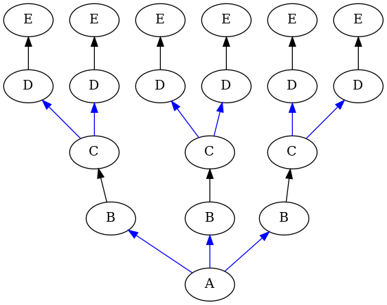

# Tree Specification Language

This is a small tool to create and visualise parallel-branching trees. For such
trees, writing the full definition of all of their nodes and edges is time
consuming. However, full specification of every node and edge isn't necessary,
only of the relationships between each *layer* of nodes and the next.

`treespec.py` defines a language that allows specification of each layer and the
relationships between them without having to specify every node and edge in a
parallel-branching tree.

For example, running `treespec.py` and passing Tree Spec Language (TSL) code as
the first parameter, like so:

    python treespec.py 'A {3IC}-> B -> C {2IC}-> D -> E'

Produces the following image (called `graph.png` in your current directory):

For additional details about the kinds of relations you can specify (and what
`I` and `C` mean in the above example), see the `Relation` class docs.

If you need to build a parallel-branching tree programmatically, you can pass in
TSL code to `treespec.parse()`, or use the `treespec.Builder` class (see its
docs for more info).
